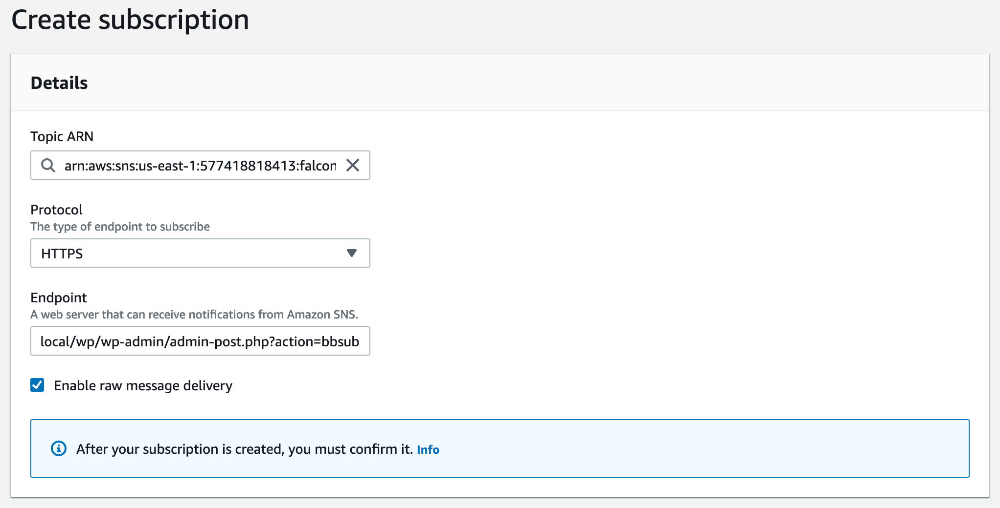
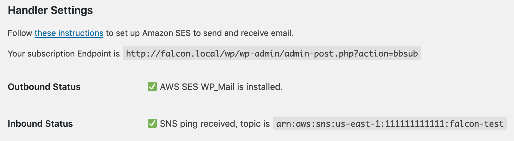

# Amazon SES

If you're using Amazon Web Services (AWS) to power your site, you can configure email to be sent and received via [Amazon SES (Simple Email Service)](https://aws.amazon.com/ses/).

To get started, select the **Amazon SES** handler in the Falcon options.

## Configuring Sending (Outbound)

To send email, Falcon uses [AWS SES WP_Mail](https://github.com/humanmade/aws-ses-wp-mail), which must be installed and configured.

Ensure you have also verified your sending domain and moved out of the sandbox, [per the setup instructions](https://github.com/humanmade/aws-ses-wp-mail#getting-set-up).

## Configuring Receiving (Inbound)

To receive email, Falcon uses an SNS (Simple Notification Service) topic, which passes email received by the SES servers to Falcon.

### Step 1: Configure SES

In the SES console, select [Rule Sets](https://console.aws.amazon.com/ses/home#receipt-rules:) under "Email Receiving".

If you don't have an active rule set, create a new one; otherwise, select your currently-active rule set.

Create a new rule in this rule set, and set the "Recipient" field to the reply-to email address you have set in the Falcon configuration. For example, if your reply-to address is `reply@falcon.example`, then this should be set to `reply@falcon.example`. (Do **not** include any plus characters.)

**Note:** This may require setting up verification DNS records if you have not already verified the domain for SES. Ensure you add these DNS records if needed; note that if you manage DNS via Route 53, you can set up the records by following the prompts.

Next, you need to set the action. Select "SNS" from the dropdown. When prompted for an SNS topic, select "Create a new topic". Enter a descriptive name for this topic (such as `falcon-inbound`) and optionally a display name. Set the Encoding to Base64.

Finally, set a name for the rule (such as `falcon-inbound`). Set any other options however you'd like, then proceed to review and create the rule.

### Step 2: Configure SNS

The next step is to connect SNS to Falcon.

In the Falcon settings, your subscription Endpoint will be displayed under Handler Settings. Copy this URL, as you will need it to create the subscription.

In the SNS console, select [Topics](https://console.aws.amazon.com/sns/v3/home#/topics). Find the topic you created in Step 1 (e.g. `falcon-inbound`) and open it.

Next, create a new Subscription. Set the "Protocol" field to HTTPS (or HTTP if you do not have SSL enabled.) Set the "Endpoint" field to the subscription endpoint copied from the Falcon admin. **Ensure you select "Enable raw message delivery".**

Click "Create subscription". After a moment, you should see the subscription is marked as "Confirmed" (you may need to refresh the page).

In the Falcon settings, you should now see Inbound Status is set as active, and your SNS topic ARN will be displayed. This indicates you are now ready to receive replies via Falcon.

